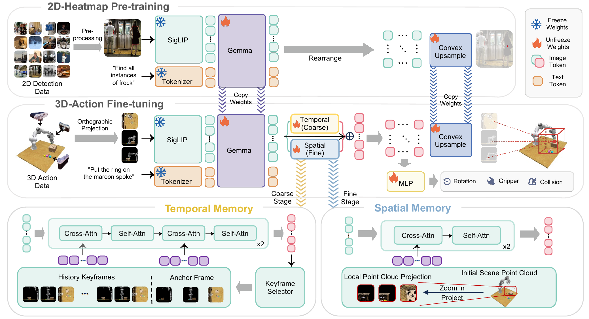

<div align="center">

# BridgeVLA++: A Data-Efficient, Generalizable, and Memory-Augmented Vision-Language-Action Framework for 3D Manipulation

A 3D VLA framework that aligns inputs and outputs in a shared 2D heatmap space, augmented with a unified spatio-temporal memory that decides *what to do next* and *where exactly to act* — extending to bimanual manipulation and new robot embodiments.

\[📄Paper (coming soon)\]  [\[🏠Project Page\]](https://bridgevla-plus.github.io/)  [\[🤗Checkpoints\]](https://huggingface.co/datasets/LPY/BridgeVLA)  [\[🪄ModelScope\]](https://modelscope.cn/models/susetiankong/bridgevla_plus)

</div>

## 🔥 News

* **`2026.08.05`** 🌟 BridgeVLA++ is released: training & evaluation code for **five simulation benchmarks** (RLBench, COLOSSEUM, GemBench, memoryBench, RMBench) and **real robot embodiments**, with checkpoints on HuggingFace / ModelScope.
* **`2025.09.20`** 🌟 BridgeVLA was accepted by NeurIPS 2025! 🥳🥳🥳
* **`2025.06.15`** 🌟 We introduced [BridgeVLA](https://github.com/BridgeVLA/BridgeVLA/tree/bridgevla), which bridges VLM backbones and VLAs by aligning input and output in a shared 2D space.

## 👀 Contents

- [Model Overview](#-model-overview)
- [Installation](#-installation)
- [Download](#-download)
- [Training](#-training)
- [Evaluation](#-evaluation)
- [Experimental Results](#-experimental-results)
- [Acknowledgement](#-acknowledgement)
- [Citation](#-citation)

## 📋 Model Overview



BridgeVLA++ keeps the dual-phase recipe of BridgeVLA: the VLM is first pre-trained to predict language-conditioned 2D heatmaps on object-detection data; for 3D manipulation, point clouds are rendered into multi-view images and actions are predicted as heatmaps in that *same* 2D space, so grounding knowledge transfers directly into action learning. On top of this, a **unified spatio-temporal memory** is injected in the VLM patch-token space: **temporal memory** keeps selected history keyframes to disambiguate task stages (*what to do next*), while **spatial memory** re-renders earlier, less-occluded geometry (*where exactly to act*). The scene-level memory can be shared across two arms, extending the framework naturally to bimanual manipulation.

## 🔧 Installation

Pick your benchmark and run **only its installer**. Each one creates a self-contained conda environment, is idempotent (safe to re-run after a network failure), and ends with an import self-check — environment details are documented in each script's header comment.

```bash
# RLBench
bash finetune/RLBench/install_rlbench.sh
```

```bash
# COLOSSEUM  (on top of the RLBench install)
bash finetune/RLBench/install_rlbench.sh
bash finetune/Colosseum/install_colosseum.sh
```

```bash
# GemBench / memoryBench  (one shared install)
bash finetune/GemBench/install_gembench.sh
```

```bash
# RMBench  (one installer covers both its envs: SAPIEN sim + shared policy env)
bash finetune/RMBench/install_rmbench.sh
```

```bash
# Grounding pre-training
bash pretrain/install_pretrain.sh
```

```bash
# Real robot — training (GPU server) / deployment (robot workstation)
bash finetune/real/install_real_train.sh
bash finetune/real/install_real_deploy.sh
```

Note: RLBench/PyRep sources are not redistributed (their license forbids it) — the installers rebuild them from pinned upstream commits plus this repo's patches. Two non-interchangeable simulation stacks are built and the train/eval scripts select the right one automatically; see [`scripts/README.md`](scripts/README.md) for this and other reference notes (env pins, consolidation, troubleshooting).

## 📦 Download

### Checkpoints & pre-training corpus

`scripts/download_checkpoints_hf.sh` pulls the released artifacts from HuggingFace (`LPY/BridgeVLA`); `scripts/download_checkpoints_ms.sh` is a drop-in ModelScope mirror (`susetiankong/bridgevla_plus`) — **identical targets and options**, just a different hub. The examples below use the HF script.

```bash
bash scripts/download_checkpoints_hf.sh --list                     # list every target + size
bash scripts/download_checkpoints_hf.sh rlbench paligemma clip     # evaluate the released RLBench checkpoint  (~19 GiB)
bash scripts/download_checkpoints_hf.sh pretrain paligemma clip    # warm start to train it yourself           (~18 GiB)
bash scripts/download_checkpoints_hf.sh pretrain_data paligemma    # re-run grounding pre-training             (~29 GiB)
```

* Each benchmark's checkpoint is just its target name — swap `rlbench` for `colosseum` / `gembench` / `memorybench` / `rmbench` (or `rmbench:<task>` for a single task). Download only what you need — `all` is ~120 GiB.
* Run the exact same arguments with `scripts/download_checkpoints_ms.sh` to pull from ModelScope instead.
* Downloads resume, and files land exactly where the train/eval scripts look.

### Benchmark datasets (third-party)

```bash
bash scripts/download_datasets.sh --extract rlbench          # RLBench      116 GiB  (+12 GiB keyframe cache)
bash scripts/download_datasets.sh --extract colosseum        # COLOSSEUM     75 GiB  (training)
bash scripts/download_datasets.sh --extract gembench         # GemBench     162 GiB
bash scripts/download_datasets.sh --extract memorybench      # memoryBench   22 GiB  (+2.3 GiB keyframe cache)
bash scripts/download_datasets.sh --extract rmbench          # RMBench      ~31 GiB  (assets + keyframe data)

# COLOSSEUM evaluation additionally needs per-task variation archives (186 GiB for all — restrict to your tasks):
COLOSSEUM_EVAL_TASKS="close_box open_drawer" bash scripts/download_datasets.sh --extract colosseum_eval
```

* Run only your benchmark's row. Evaluation replays the released *test* episodes from the same tree, so eval needs the data too.
* `--extract` also fetches the pre-built keyframe caches from our release (**required** for RLBench — training loads it strictly). Those release-hosted parts come from HuggingFace by default; `BRIDGEVLA_DL_SOURCE=ms` pulls them from ModelScope instead (the third-party datasets themselves exist on HuggingFace only).
* Upstream sources, the resulting `data/` layout, and cache details: [`scripts/README.md`](scripts/README.md). Real-robot data is self-collected and not published.

## 🚀 Training

One command per benchmark; all warm-start from the grounding pre-training (`data/bridgevla_ckpt/pretrain`) by default:

```bash
bash finetune/RLBench/train.sh        # RLBench, 18 tasks
bash finetune/Colosseum/train.sh      # COLOSSEUM
bash finetune/GemBench/train.sh       # GemBench L1
bash finetune/memoryBench/train.sh    # memoryBench, 3 tasks
bash finetune/RMBench_vla/train.sh    # RMBench (bimanual)
bash finetune/real/train.sh           # real-robot data
```

* `PRETRAIN_PATH=<run>/pretrain_epoch_<N>.pth bash …` warm-starts from your own pre-training run; `--no-pretrain` for a deliberate cold start.
* Outputs land in `data/bridgevla_data/logs/<train_*>/<run>/`, already in the layout evaluation expects.

Re-running the grounding pre-training itself is optional (the released checkpoint is the default warm start):

```bash
bash scripts/download_checkpoints_hf.sh pretrain_data paligemma
tar -xzf data/bridgevla_data/pretrain_data/coco.tar.gz -C data/bridgevla_data/pretrain_data/
bash pretrain/pretrain.sh             # 8 GPUs by default (RESOURCE_GPU=N to change)
```

## 🧪 Evaluation

Each command evaluates the benchmark's released checkpoint on its full test set:

```bash
bash finetune/RLBench/eval.sh                                # RLBench
bash finetune/Colosseum/eval.sh                              # COLOSSEUM
bash finetune/RMBench/policy/BridgeVLA_Plus/eval_double_env.sh  # RMBench
```

GemBench and memoryBench run as a server + a client, in two terminals:

```bash
bash finetune/GemBench/run_server.sh      # terminal 1
bash finetune/GemBench/run_client.sh      # terminal 2

bash finetune/memoryBench/run_server.sh
bash finetune/memoryBench/run_client.sh
```

Real robot, on the robot workstation:

```bash
python finetune/real/rvt_our/eval_flask_app.py
ARM_IP=<robot-ip> LOCAL_IP=<host-ip> python finetune/real/rvt_our/eval_client.py
```

Results are written under `<ckpt dir>/eval/` and summarised by each benchmark's `summarize_eval.py`. To evaluate your own run, or select tasks / seeds / videos / memory ablations, see the usage block at the top of each script.

## 📈 Experimental Results

Headline success rates (%) across the five simulation benchmarks. The memory architecture buys a huge win on the memory-dependent benchmarks, and the averages on the original three go **up**, not down:

| Benchmark | what it stresses | BridgeVLA | **BridgeVLA++** |
|---|---|---|---|
| **RLBench** (18 tasks) | basic 3D manipulation | 90.5 | **93.7** |
| **COLOSSEUM** (14 settings) | OOD perturbations | 64.0 | **65.2** |
| **GemBench** (L1–L4 avg) | compositional generalization | 50.0 | **51.1** |
| **memoryBench** (3 tasks) | temporal / spatial memory | 11.3 | **99.7** |
| **RMBench** (9 bimanual tasks) | memory + two arms | 18.9 | **96.0** |

On the real robot, BridgeVLA outperforms a strong baseline by **32%** on average on memory-independent tasks, and BridgeVLA++ lifts memory-dependent tasks from **20.0% → 93.3%**. Full per-task tables, ablations, and protocols are in the paper.

## 🙏 Acknowledgement

We stand on the shoulders of giants. BridgeVLA++ is built on / evaluated with:
[BridgeVLA](https://github.com/BridgeVLA/BridgeVLA/tree/bridgevla) ·
[RVT-2](https://github.com/NVlabs/RVT) · [PerAct](https://github.com/peract/peract) ·
[PaliGemma](https://huggingface.co/blog/paligemma) ·
[RoboPoint](https://github.com/wentaoyuan/RoboPoint) ·
[RLBench](https://github.com/stepjam/RLBench) · [PyRep](https://github.com/stepjam/PyRep) ·
[robot-colosseum](https://github.com/robot-colosseum/robot-colosseum) ·
[GemBench / robot-3dlotus](https://github.com/vlc-robot/robot-3dlotus) ·
[MemoryBench / SAM2Act](https://sam2act.github.io/) ·
[RMBench](https://github.com/RoboTwin-Platform/RMBench) / [RoboTwin 2.0](https://robotwin-platform.github.io/) ·
[YARR](https://github.com/stepjam/YARR) · point-renderer (NVIDIA, via RVT).

This repository is released under **Apache-2.0** (see `LICENSE`); vendored third-party components keep their original licenses.

## 📝 Citation

```bibtex
@article{bridgevlaplus2026,
  title   = {BridgeVLA++: A Data-Efficient, Generalizable, and Memory-Augmented
             Vision-Language-Action Framework for 3D Manipulation},
  author  = {},
  journal = {},
  year    = {2026},
  note    = {Extension of the NeurIPS 2025 paper BridgeVLA}
}

@misc{li2025bridgevla,
  title         = {BridgeVLA: Input-Output Alignment for Efficient 3D Manipulation
                   Learning with Vision-Language Models},
  author        = {Peiyan Li and Yixiang Chen and Hongtao Wu and Xiao Ma and Xiangnan Wu
                   and Yan Huang and Liang Wang and Tao Kong and Tieniu Tan},
  year          = {2025},
  eprint        = {2506.07961},
  archivePrefix = {arXiv},
  primaryClass  = {cs.RO},
  url           = {https://arxiv.org/abs/2506.07961}
}
```
